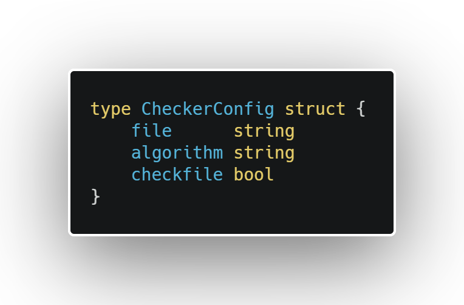
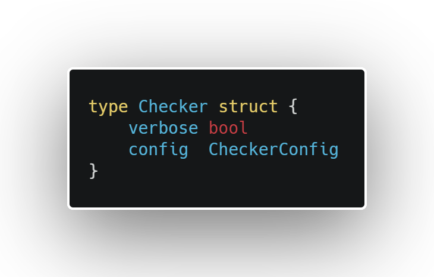

# integrity-checker

## Table of content

* [Installation](##Installation)
* [Usages](##Usages)
  * [CLI](###CLI)
  * [API](###API)
* [Examples](##Examples)

## Installation

`Go` is required to run this program. You can download the `Go` installer [here](https://golang.org/dl/).  
Once `Go` is installed, you can clone the project using `git`:  
HTTPS: `git clone https://github.com/DataHearth/integrity-checker.git`  
SSH: `git@github.com:DataHearth/integrity-checker.git`  
  
Another solution is to use Go itself:  
`go get github.com/DataHearth/integrity-checker`

## Usages

You have 2 way to run the programm, use the `CLI` version or the `API`.  
The `CLI` is made for a quick usage like checking a download, etc...  
The `API` version is made for an integration in another program. 

### CLI
To use the program, 5 flags are available. One is required and 4 have default values. Flags order don't matter as long the required one is not missing.  

`-algorithm`: Which algorithm is use with your checksum or your checkfile's checksums.  
__Supported algorithms__: `SHA1, SHA224, SHA256, SHA384, SHA512, SHA512/224, SHA512/224, MD5`  
__Default__: `SHA1`  
*Note*: If your favorite algorithm is missing, you can create an issue and I'll do my best to implement it as soon as possible.  
  
`-file`: Path to your file. It could be a checkfile or a simple to check.  
__Require__  

`-checksum`: If the file provided in the flag `-file` is a simple file, this field should contain the related checksum.  
__Default__: An empty string  

`-check`: If the file provided in the flag `-file` is a checkfile, put the flag to `TRUE`.  
__Default__: `TRUE`  

`-verbose`: An option if you want to have details during the process  
__Default__: `FALSE`  

### API
Two Structures are available:

The `CheckerConfig` structure is here to set a global configuration a checker.  It takes a file (path), an algorithm and if the file is a checkfile. 

`Checker` structure is simpler, a verbose field (if you want more output) and it's related configuration. Please note that functions are implemented to work with `Checker` and are only available through a `Checker` object.

## Examples